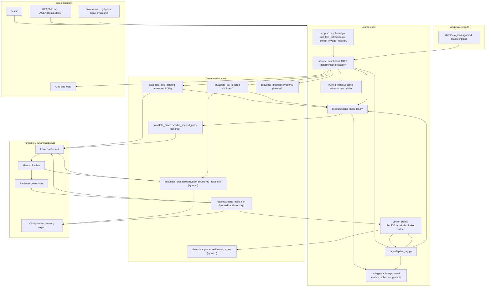

# Project Workflow Graph

This diagram shows the intended separation between source code, raw/private inputs, generated outputs, review state, tests, logs, and documentation. It uses Mermaid syntax and does not require a graph dependency.

Safety boundaries:

- Treat `data/data_raw/` as immutable private input and keep it ignored.
- Write generated OCR, PDF, CSV, report, Gemini, and vector artifacts only under `data/`.
- Keep provider memory in `rag/knowledge_base.json`; it may contain reviewer feedback and should remain ignored unless sanitized.
- Treat `data/data_processed/vector_store/` as a generated local retrieval index built from provider memory.
- Keep secrets out of logs, docs, generated reports, and committed files.
